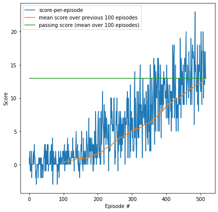

# Project Report

## Method
The solution implements a [DDQN](https://en.wikipedia.org/wiki/Q-learning#Deep_Q-learning) agent using an MLP neural network model for approximating the two q-networks.

### Model architecture:
The q-networks are each implemented as a Multi-Layer-Perceptron with 3 internal layers of sizes 32, 64 and 64 with RELU activations and an output layer of size 4 (the number of actions in the environment).
```
>>> agent.qnetwork_local.network
Sequential(
  (0): Linear(in_features=37, out_features=32, bias=True)
  (1): ReLU()
  (2): Linear(in_features=32, out_features=64, bias=True)
  (3): ReLU()
  (4): Linear(in_features=64, out_features=64, bias=True)
  (5): ReLU()
  (6): Linear(in_features=64, out_features=4, bias=True)
)
```

The layers are initialized with [xavier_uniform](https://pytorch.org/docs/stable/nn.init.html#torch.nn.init.xavier_uniform_)

### Agent parameters
The parameters used in the agent are:
```
BUFFER_SIZE = int(1e5)  # replay buffer size
BATCH_SIZE = 256  # minibatch size
GAMMA = 0.99  # discount factor
TAU = 1e-3  # for soft update of target parameters
LR = 5e-4  # learning rate
UPDATE_EVERY = 4  # how often to update the network
```
### DQN details
The running of the DQN - interaction of agent in the environment while updating it's policy and the tracking of performance is all handled by the function `dqn` in the notebook. This is a modification of the function with the same name from (the Udacity DQN exercise notebook)
https://github.com/udacity/deep-reinforcement-learning/blob/master/dqn/exercise/Deep_Q_Network.ipynb , adapted ro run the unity Bananas environment.

The function implements epsilon-greedy action gelection with an exponentially decaying epsilon controlled by:
```
 eps_start = 1.0   # starting epsilon (uniform action selection)
 eps_end = 0.01    # minimal epsilon (beyond which it is kept at this value)
 eps_decay = 0.995 # epsilon decay rate (updated once after each episode)
 ```

## Results

 The results of training (taken from the notebook) are here:
 
 

 The figure shows that the environment was solved in 416 episodes when the agent reached an Average Score over the last 100 episodes of 13.07.

## Possible improvements
* Apply DQN improvements such as prioritized experienct replay and Duelling DQN.
* Find better hyperparameters with tools such as [Ax](https://ax.dev/).
* Find better model architectures.
* Try On-Policy methods.
